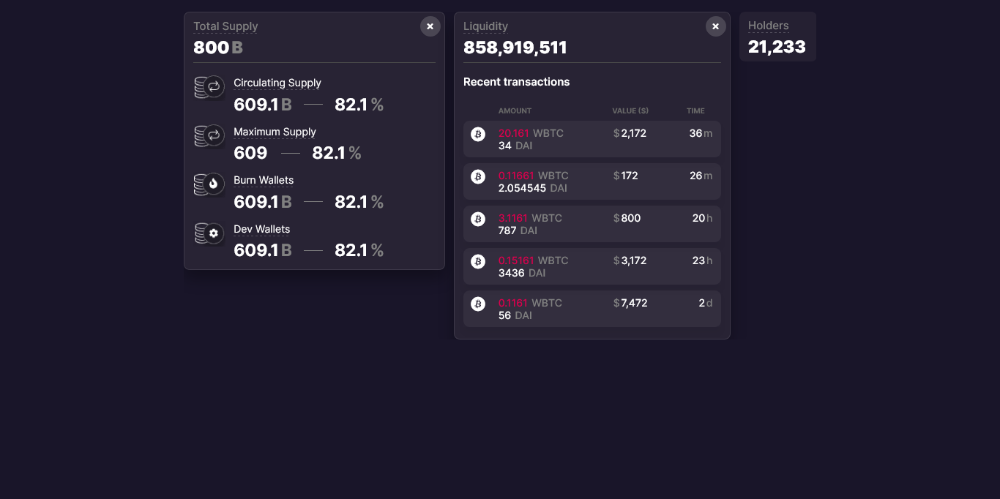

# Databox Component

The **Databox Component** is a resusable and flexible UI component that can accommodate any **Data Component** regardless of the width and height. The additional content is initially hidden and only shown when expanded.





## Features of Databox Component

 - It can contain any **Data Component** passed to it.
 - It features a toggle system that hides the **Data Component** passed to it.
 - The **Data Component** can only be shown when the interface or the expansion control icon are clicked.
 - The expansion control icon animates from a "+" (closed state) to a "X" (opened state) using react-spring library.
 - The **Databox Component** conditionally expands only if there is a content passed into it. In this case, the expansion control will be removed and the onClick event will be deactivated.
 

## Run Locally

Clone the project

```bash
  git clone https://github.com/folathecoder/sonar-databox-component.git
```

Go to the project directory

```bash
  cd sonar-databox-component 
```

Install dependencies

```bash
  npm install
```

Start the server

```bash
  npm run start
```

